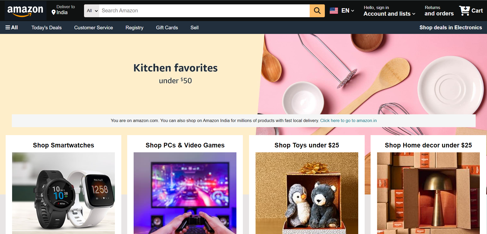
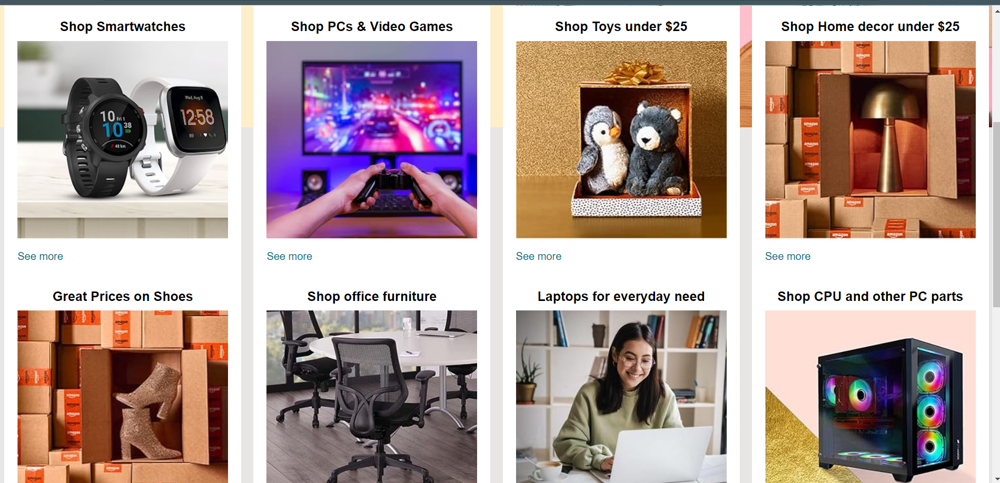

# Amazon Homepage Clone

This project is a clone of the Amazon homepage, built using only **HTML** and **CSS**. It is designed to mimic the basic layout and design of the Amazon website's main page.

## Features

- Fully responsive design, adjusting seamlessly for various screen sizes.
- Replication of the Amazon homepage structure, including:
  - Header with logo, search bar, and navigation links.
  - Hero section with promotional banners.
  - Grid-style product listings.
  - Footer with links and additional resources.

## Demo

You can view a live demo of the project [here](https://amazon-homepage-clone-varnik.netlify.app/).

## Technologies Used

- **HTML5**: For the page structure and content.
- **CSS3**: For styling, layout, and responsiveness.

## How to Use

1. Clone the repository:
   ```bash
   git clone https://github.com/Varnik2500/Amazon-Homepage-Clone.git
   ```

2. Open the `index.html` file in your browser to view the page.

## Future Enhancements

- Add interactivity using JavaScript (e.g., search bar functionality, product carousel).
- Implement a backend to handle user login, product data, etc.

## Screenshots

Here are some screenshots of the homepage clone:




## Acknowledgements

This project was built for educational purposes to practice web development skills and is not an exact copy of Amazon's actual website.
